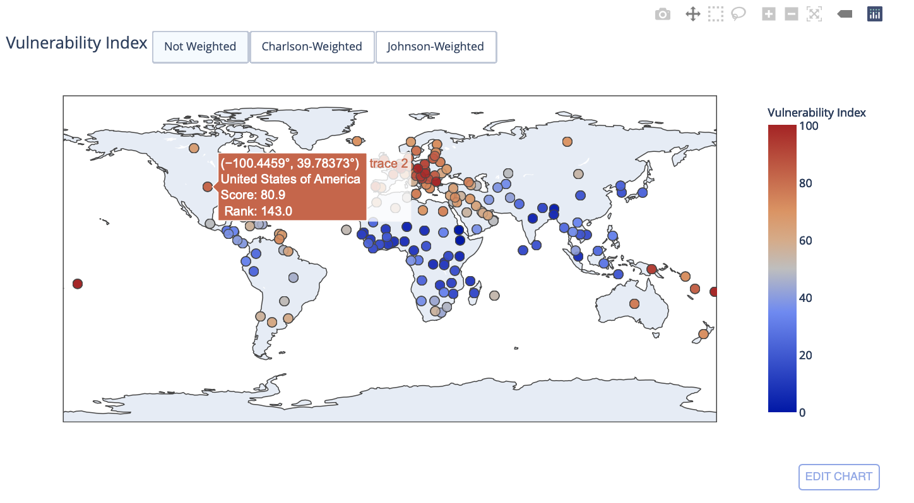

# Risk Factors 
Refer to [Notebook](https://dataplatform.cloud.ibm.com/analytics/notebooks/v2/66a8947b-b39b-4ec5-bc45-ea23eec72c38/view?access_token=f21c519248715a535d58252bfe1dd7021e3d2d6690501e67ea5c50cb771a618b) to interact with the map and download the datasets

__Problem:__
Building an NCD-vulnerability index that is calculated from 22 different risk behavioral and metabolic risk factors and NCD prevalence indicators.

This will serve in raising awareness on COVID-19 NCD links (advocacy), spurring debate, and informing policy decisions (possibly at a later stage, as we acquire better data and improve the index).

__Data Sources:__
- Global Information System on Alcohol and Health (GISAH)
- Global Burden of Disease Collaborative Network.
- Global Burden of Disease Study 2017 (GBD 2017) Results.
- Seattle, United States: Institute for Health Metrics and Evaluation (IHME), 2018.
- Available from http://ghdx.healthdata.org/gbd-results-tool.

__Methodology:__
- Data collection of risk indicator information for different countries
- Data cleaning (grouping of indicators into four groups: NCD, metabolic risk factor, behavior risk factor, and other -- ensuring consistent country naming -- filling in missing indicator data -- normalizing data)
- Calculating weighted and un-weighted vulneability index and ranking countries accordingly
- Visualizing the data using on a map and further using a dashboard on Domo for further analysis, reporting and internal use by stakeholders

__Python Packages:__
- Arrays and data structures (pandas and numpy)
- Statistics (scipy.stats)
- Visualization (chart_studio, plotly, seaborn, matplotlib.pyplot)
